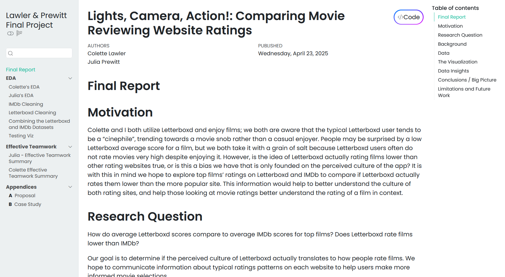
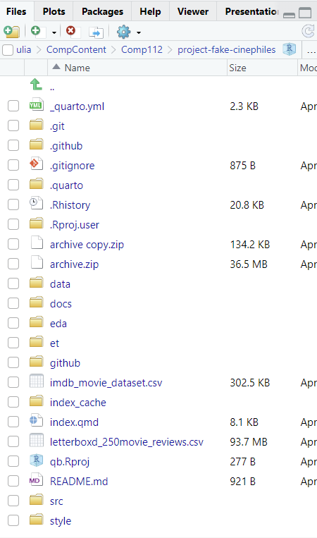

# Project Description

This is the repository for Colette & Julia's COMP/STAT 112 group project from Spring of 2025.
It seeks to explore the difference in rating for Letterboxd's top 250 movies as compared to IMDb's ratings and see if Letterboxd users actually rate things lower than other sites do.

# Software Requirements

R version 4.4.3+ and RStudio 2024.12.1 Build 563

# How to Run this Repository

Make sure R and RStudio are both installed on your machine and you have familiarity with them.

Add the files to your desired location on your device, and open the qb.Rproj file.

You can render the book to view the web version, or explore the code on your own!

# Expected Output

If you render the book on your machine it should take you to the project website, which should look like this:

If you remain in RStudio, you can expect to see the files organized like this:

-   index.qmd is the main report page

-   eda - exploratory data analysis pages, as well as data processing pages

-   et - explaining effective teamwork methods

-   data - contains datasets used for the project

-   src -\> appx - contains original project proposal, case study of additional data

# Presentation

<iframe src="https://docs.google.com/presentation/d/e/2PACX-1vTZhjyTv_x0CqXX9l19h_gHB3UKue4ZyMZ63YzAhRUFgrPBx-ipfrAmgt1oLP713-K5F3-vdlsWd0P8/pubembed?start=false&loop=true&delayms=3000" frameborder="0" width="960" height="569" allowfullscreen="true" mozallowfullscreen="true" webkitallowfullscreen="true"></iframe>
